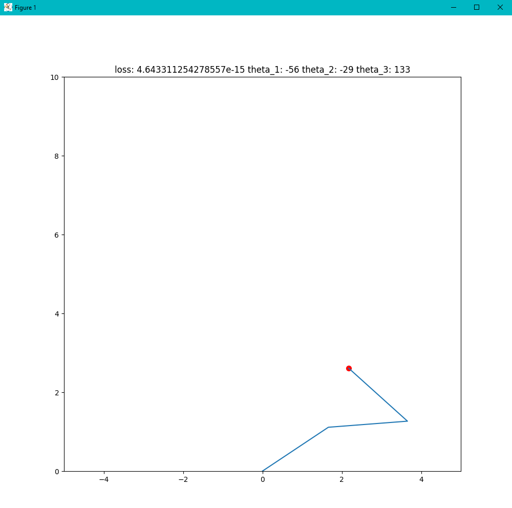

## Inverse Kinematics

### Calculation of vector angles via derivatives:

### Output:

## Regression Task 1

### Output:

## Regression Task 2

### Output:

## Main Findings:

### Inverse Kinematics

In Inverse Kinematics I managed to practise once more with rotating vectors via matrixes. Most succesfull part was calculation of vector angles via derivatives. I implemented algorithms from workshop that allow vectors to decrease loss between current and desired position.

### Regression Task

In Regression Tasks I practised with backpropogation algorithms that calculates weight and biases for future predictions of X values. Hardes part was about decomposing function when sequence of deriviation was performed.

## Questions:

Frenkly speaking, this time I don't have any questions.