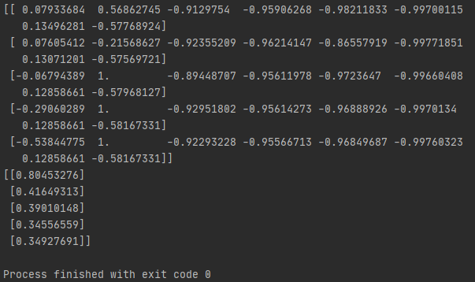
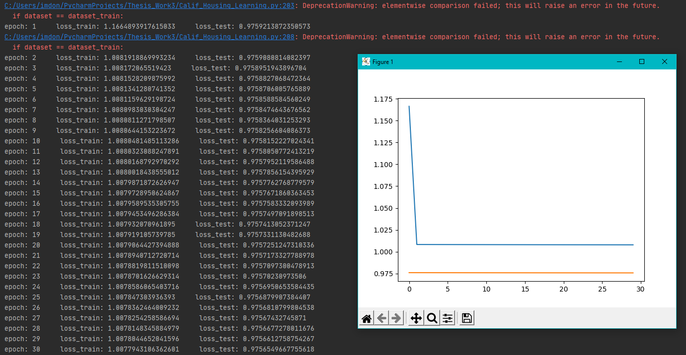

# First task

## Output

# Second Task

## Output

## Main Findings:

### Task 1

I have implemented calculations and deriviation of my model and errors using calsses. Aslo I applied normalization of the values.

### Task 2

Most interesting part was about impleemnting Optimizer (the structure which allows you to teach your model) and usage of that. Also standardization of X, Y values was applied.

## Questions:

### Task 1

I didn't manage to return Y values to the not normilized.

Also I think I implemented everything that was asked, however this programm doesn't teach itself. Fot this we would need Optimizer structure (as it was showen in the next task). My question is: was it intended to implement simply the classes, normalization function, losses and make only one iteration of every calculation to make sure that implemented structures work?

### Task 2

Again, I think that everything I implemented is correct, however, the errror that I have reduces really slowly. Maybe it should be like this because of the calculation functions that we use in the model, but, still, I am not sure in the correctness.