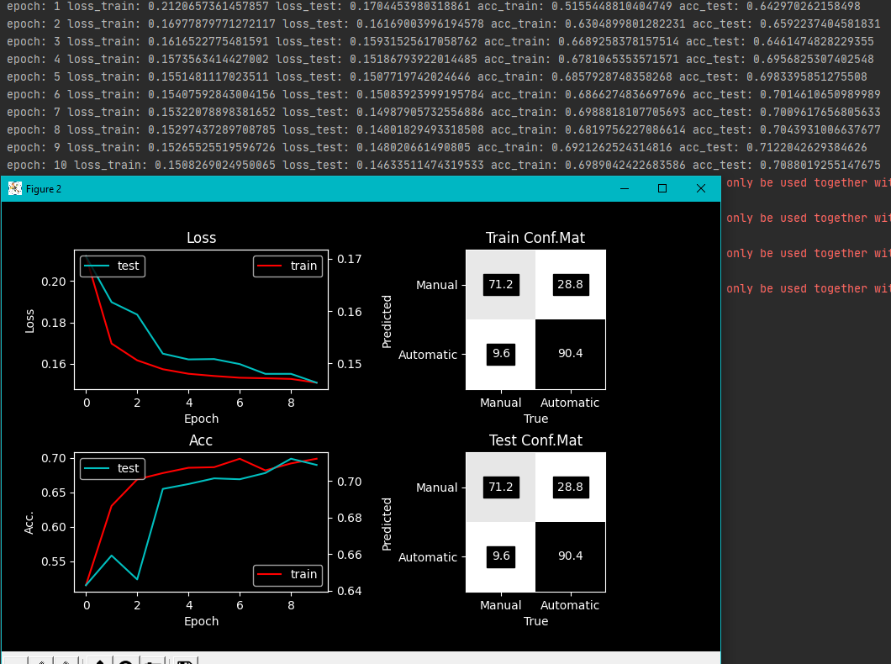

# Regression task

## Code:

## Output:

# Classification Task

## Code:

## Output:

# Classification Iris

## Code:

## Output:

## Questions:

### Regression task:

Everything is clear.

### Classification Task

I didn't understand what does "Manual" and "Automatic" means in plot output. It would be clear if we would predict either car is "Manual" or "Automatic" but with the labels we choose in out model inputs (we choose 0, 2, 3 labes, which are brand, transmission, dealership - we can only predict the last label nnumber 1, which is fuel type) it has no meaning for me.

### Classification Iris:

I have done what was asked (change dataset and model, so it would work with Iris dataset) and values seems correct to me, but I am stil not sure that everything is as it was expected.