# Task 1 (implement standardization)

## Code:
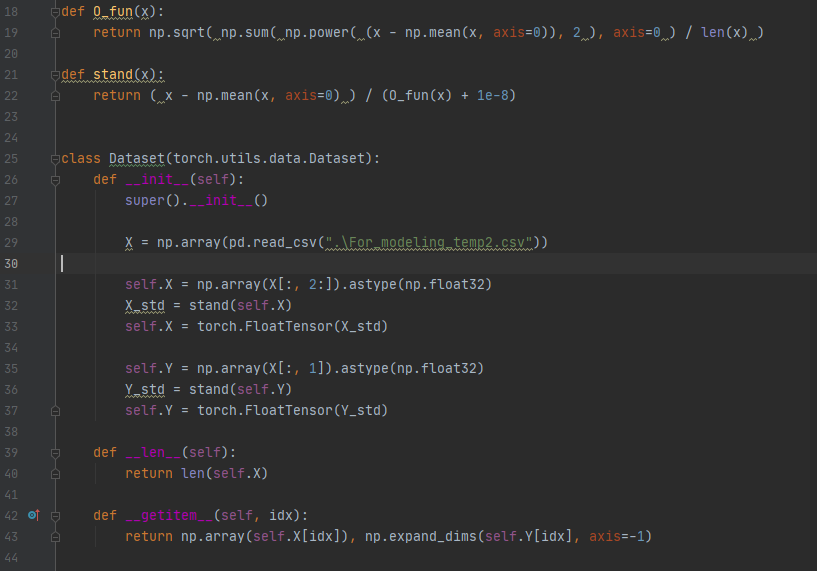
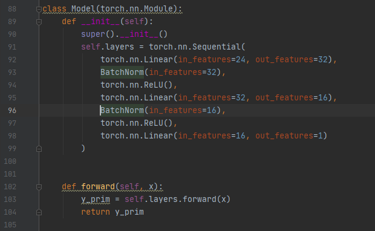

## Output:

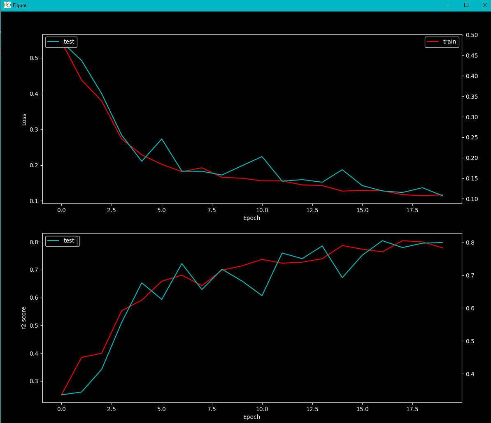
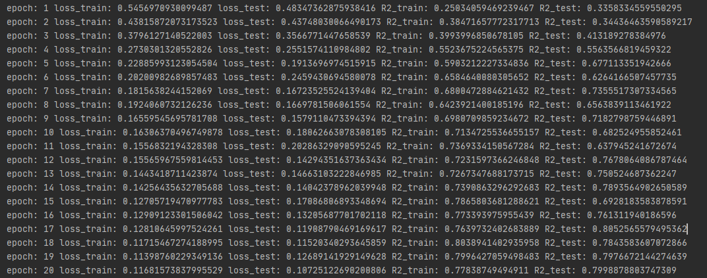

# Task 2 (Reduce overfitting)

## Explanation:
I have chosen 4 different datasets. of them shows stable overfitting, so I will show code connected to this dataset.

## Code with overfitting (without BatchNorm):
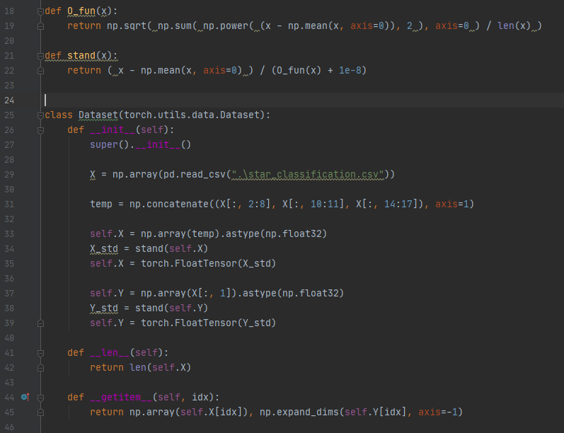
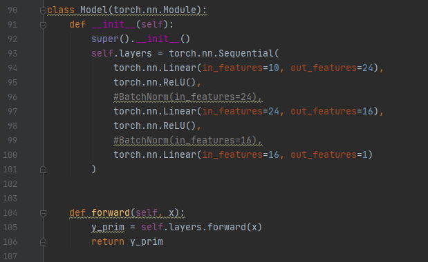

## Output with overfitting (without BatchNorm):

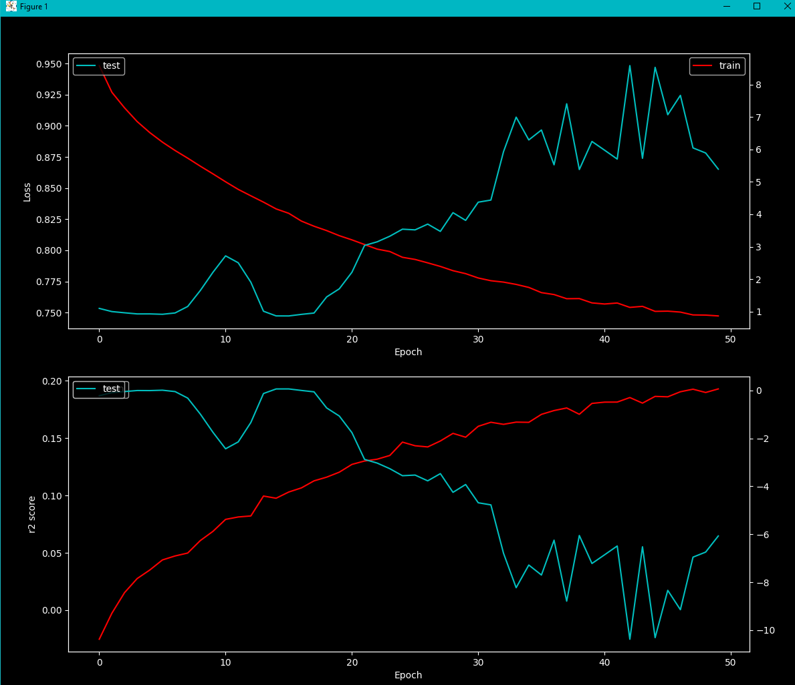
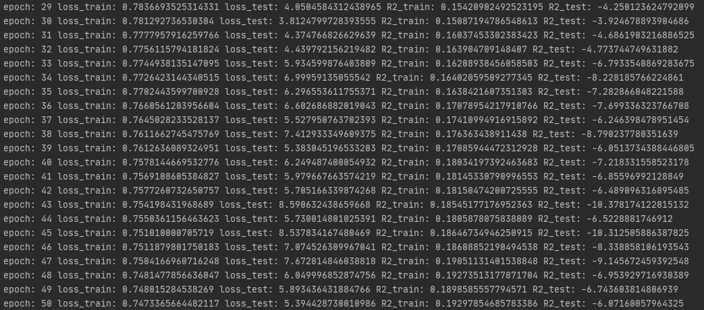

## Code without overfitting (with BatchNorm):

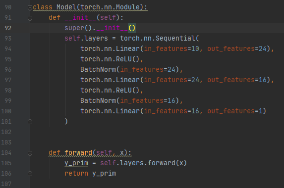

## Output without overfitting (with BatchNorm):

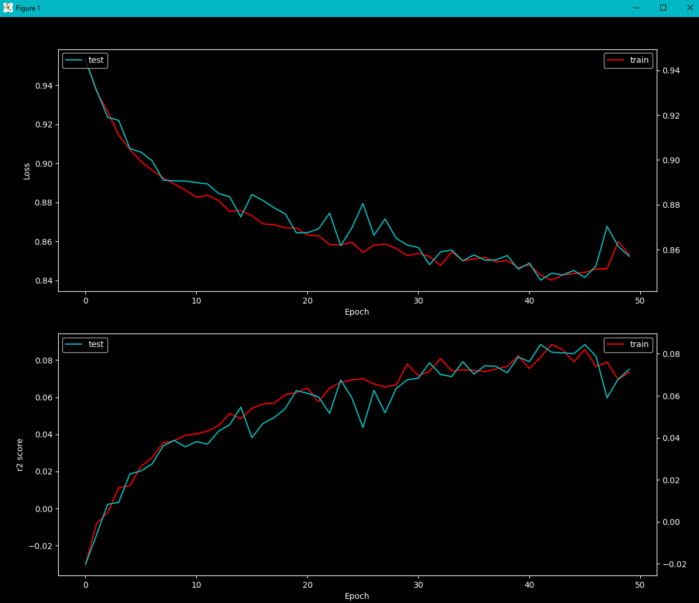
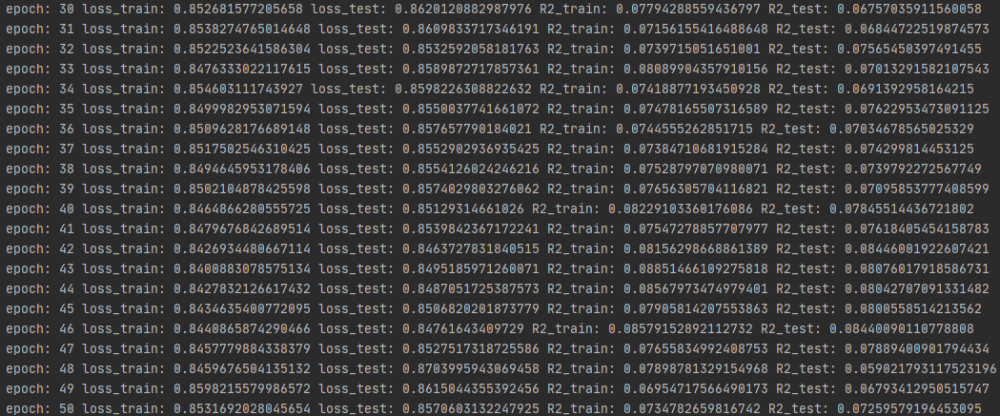

## Questions:

I didn't manage to implement hyper-parameters so they would pass using argpass. More or less, I understood the idea, but code that was given to me - was quite complex.

Also, I am not sure if I have done overfitting task correctly, as I could see overfitting only with one dataset, other - were processing quite well through my models.