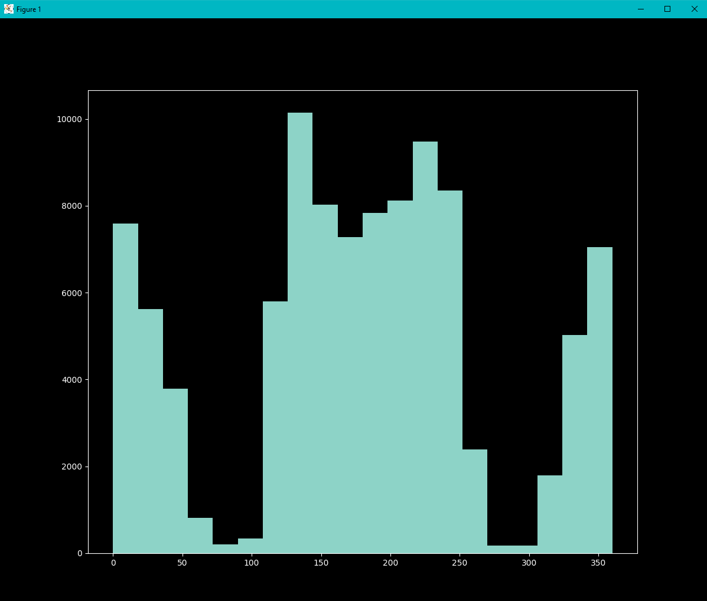
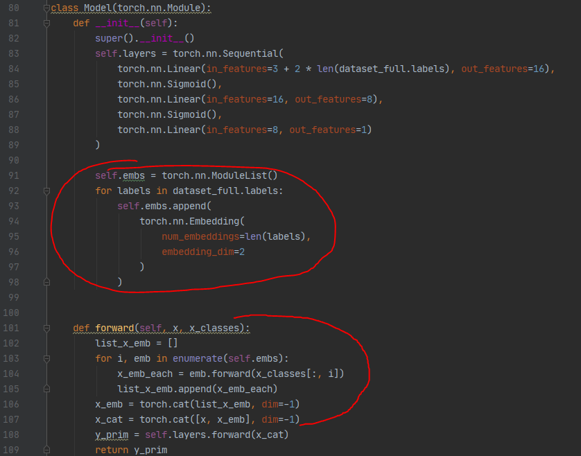

# Task 1 (histogram)

## Code:

I have implemented histogram for my Y values of the dataset. It shows occurrences of different values in a variety of ranges.

## Output:

On the output, we can see my histogram on the first picture and histogram of this dataset from the kaggle resource. It is clearly seen that those correnspond a lot.

# Task 2 (Theoretical part)

## Explanation:
No code to show. I have prepared theoretical material from different books, written down some citations and I am going to combine them in final version of my first part of the thesis.

## Questions:

### Task 1 (Histograms)

More or less I managed to plot different data from my dataset (Y values, X values, whole dataset), however I have a really stupid question. If we are talking about Y values - I clearly understand the idea of histogram. As I already shown the program outputs histogram with occurrences of different values in a variety of ranges, which I think is what was asked.
But, when I need to plot the whole dataset - I don't clearly understand, what should be plotted. I can assume that I would need to combine values of different parameters with the bars of their names, but what would be the values of the column? Would it be the maximum, or the average, or the sum of this parameter?

### Task 2 (Embedding)

Frankly speaking, the only experience I had with including categorical inputs was with dataset from your example:

and this model:

I can manage with constructing the model, however creation of the dataset that was in your example is kind of complicated. I don't really know how to create labels and X_classes with my dataset. In your dataset it was realized on the 39th line of code, but when I try to load data from my csv to 3 different variables (as it is done in your example) - there is an error (due to different loading technics). And I don't really know how to avoid this error.

### Task 3 (Hyper-parameter inputs using argparse)

For now it is the hardest task I was doing. I am really trying to understand the idea and technic of how argparse should be implemented, however I have no experience in it and the resources that I found and that were given are kind of not still enough. I wanted to ask, if you could recommend more resources (maybe you have workshops on YouTube doing something connected with it), or you could show me some examples of how it should work. I am sorry to upload the work with totally unfinished task.