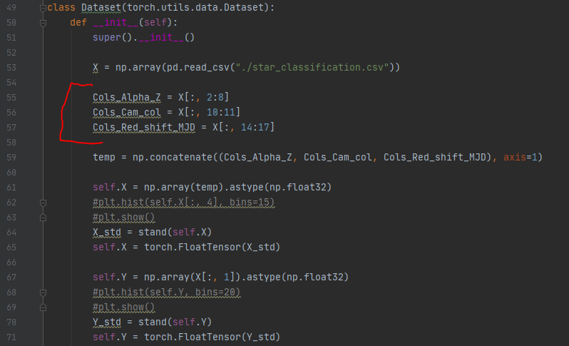
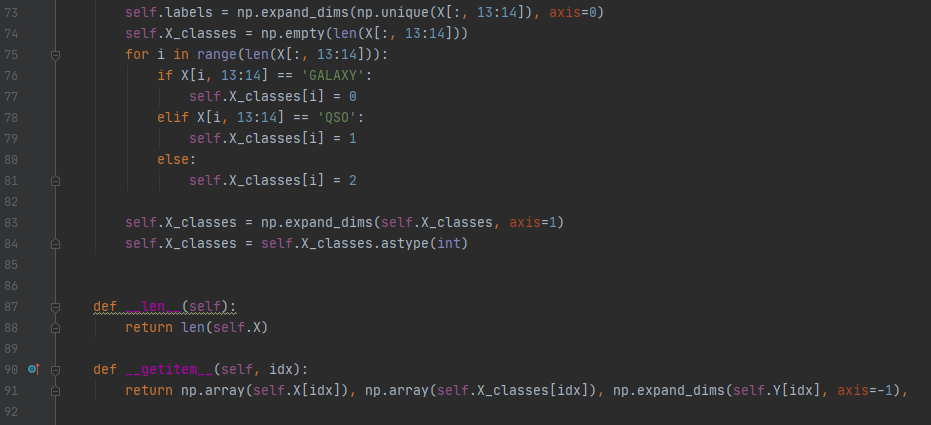
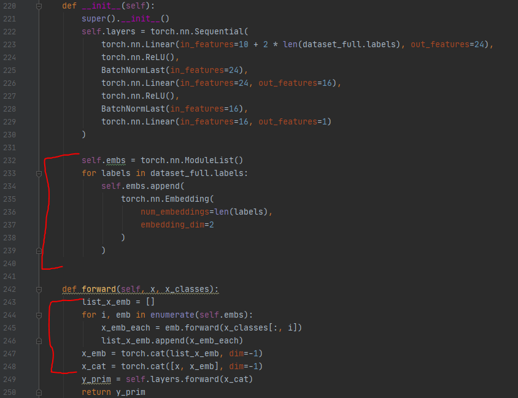
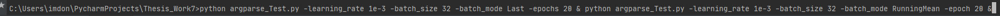
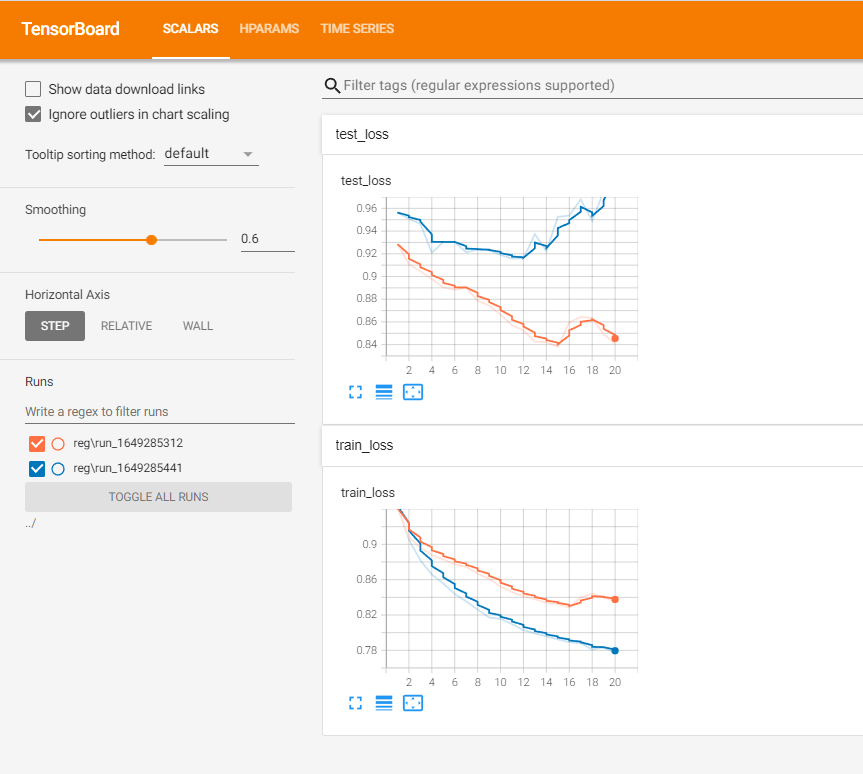
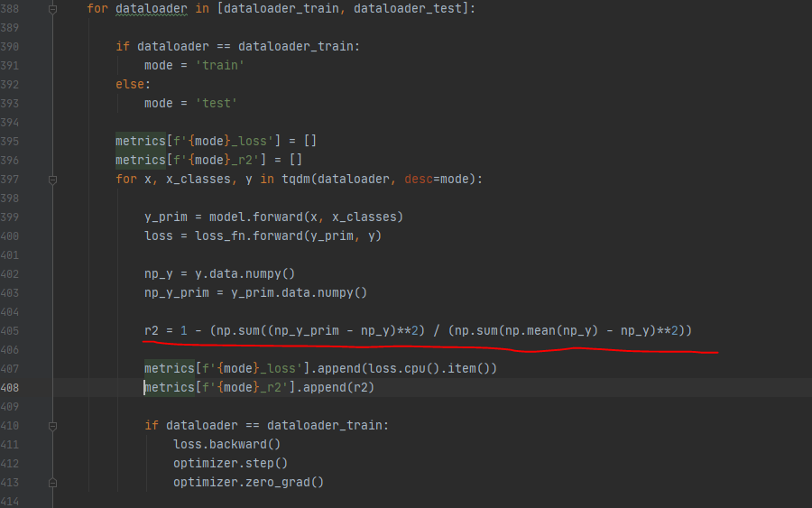

# Task 1 (Variables)

## Code:

I have created several variables with needed name, so code now is readable.

# Task 2 (Embeddings)

## Explanation:
I added this structure to implement categorical inputs.

# Task 3 (Tensorboard)

## Explanation:
On the screenshots you can see that I added different argparse so several hyper-parameters could be chosen via terminal. (learning_rate, epochs, batch_size and BatchNorm function).

## Questions:

### Question 1:
I didn't manage to implement BatchNormSimple. I dont understand how to realize u_train and o_train values.

### Question 2:
I have several problems with r2 score.W When I try to calculate it - NaN values occurre.

### Question 3:
I didn't manage to find required datasets that were alredy used in other scientific papers. All of those I found - were related to image datasets.

